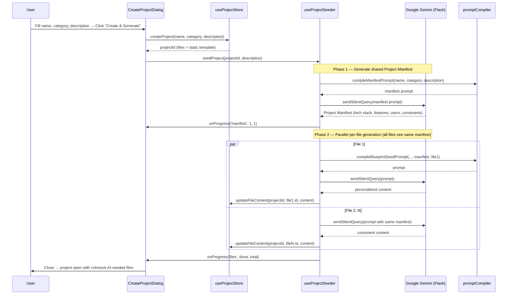

# Feature Plan: Project Description Prompt at Initialization

## Background

Currently all projects of the same category share an identical static file tree (`TEMPLATES[category]`).
The `systemGuardrails` field already exists in `DomainProfile` and is already injected into every
AI prompt — but it is never populated by the user. It is hardcoded to `"Domain: ${category}"`.

This feature closes both gaps simultaneously:

1. **User-provided description** — a free-text input collected in the "New Project" dialog
2. **AI-seeded initial file content** — the description is sent to the LLM to generate personalized
   starter content for each file instead of copying the static template verbatim

---

## Decisions

> [!NOTE]
> **Q1 — Sync or async project creation? → ✅ Option A (Blocking)**
> The dialog blocks with a progress UI while the LLM generates content. The project opens only when all files are ready. Simpler state machine, no partial-content flash.

> [!NOTE]
> **Q2 — Per-file generation or single-batch? → ✅ Per-file, with a two-phase cohesion strategy**
> Naive parallel per-file generation risks incoherence (File A invents PostgreSQL, File B invents MongoDB).
> The solution is a **two-phase approach**:
> - **Phase 1** — One fast LLM call generates a short **Project Manifest** (tech stack, core features, user roles, key constraints). This is the shared source of truth.
> - **Phase 2** — All files are generated in parallel (`Promise.all`), each prompt receiving the Manifest as context alongside the description. All files are guaranteed to reference the same decisions.
>
> This gives parallel speed (fast) with single-source-of-truth cohesion.

> [!NOTE]
> **Q3 — Description field required or optional? → ✅ Optional**
> Empty = instant static template (current behavior, no LLM call). Filled = two-phase AI-seeded generation with loading state.

---

## Proposed Changes

### Layer 1 — Types

#### [MODIFY] [project.ts](file:///d:/najib/3_resources/software-engineering/contextprd/src/types/project.ts)

Add `description` to `DomainProfile`. This stores the user's raw input permanently so it can be
re-injected into future AI chat prompts (giving the AI persistent project context).

```typescript
export interface DomainProfile {
  category: DomainCategory;
  description: string;          // NEW — user-provided project description
  systemGuardrails: string;
  templateBlueprint: Record<string, string>;
}
```

---

### Layer 2 — Prompt Compiler

#### [MODIFY] [promptCompiler.ts](file:///d:/najib/3_resources/software-engineering/contextprd/src/lib/ai/promptCompiler.ts)

**Change 1:** Inject `description` into the existing `compileContextPayload` system prompt block.
This means the AI in the chat sidebar will always know what the project is about.

```typescript
// In the prompt string, add after Guardrail Assertions:
Project Description: ${project.profile.description || 'Not specified'}
```

**Change 2 (NEW):** Add `compileManifestPrompt` — Phase 1 of seeding.

```typescript
export function compileManifestPrompt(
  projectName: string,
  category: DomainCategory,
  description: string,
): string {
  return `
You are a software architect. Based on the project description below, produce a concise
Project Manifest that will be used to ensure all PRD documents are internally consistent.

PROJECT:
- Name: ${projectName}
- Domain: ${category}
- Description: ${description}

Output a short markdown block with EXACTLY these fields:
## Project Manifest
- **App Name:** ...
- **Core Features:** (comma-separated list of 4–6 features)
- **Target Users:** ...
- **Tech Stack:** (comma-separated, specific technologies)
- **Key Constraints:** (comma-separated, e.g. GDPR, offline-first, mobile-first)

Be specific. Do not use generic placeholders. Output ONLY the manifest block.
  `.trim();
}
```

**Change 3 (NEW):** Add `compileBlueprintSeedPrompt` — Phase 2 of seeding. Now accepts the manifest.

```typescript
export function compileBlueprintSeedPrompt(
  projectName: string,
  category: DomainCategory,
  description: string,
  manifest: string,          // ← output of Phase 1, shared across all files
  fileName: string,          // e.g. "01_Overview.md"
  templateContent: string,   // the static template as structural scaffold
): string {
  return `
You are an expert software architect generating a PRD document for a real project.

PROJECT CONTEXT:
- Name: ${projectName}
- Domain: ${category}
- Description: ${description}

PROJECT MANIFEST (authoritative — all files must be consistent with this):
${manifest}

DOCUMENT TO GENERATE: ${fileName}

Use the following as a structural template. Keep the same headings and sections.
Replace ALL placeholder examples with real content consistent with the manifest above.
Do not contradict the manifest. Do not invent features not mentioned in the description or manifest.

TEMPLATE STRUCTURE:
\`\`\`markdown
${templateContent}
\`\`\`

Output ONLY the final markdown content. No preamble, no explanation.
  `.trim();
}
```

---

### Layer 3 — Store

#### [MODIFY] [useProjectStore.ts](file:///d:/najib/3_resources/software-engineering/contextprd/src/store/useProjectStore.ts)

**Change 1:** Update `createProject` signature to accept an optional `description`.

```typescript
// Interface
createProject: (name: string, category: DomainCategory, description?: string) => string;

// Implementation — store description in profile
profile: {
  category,
  description: description ?? '',
  systemGuardrails: `Domain: ${category}`,
  templateBlueprint: {},
},
```

**Change 2:** Add `updateProjectDescription` action for future editability (optional, low cost to add now).

```typescript
updateProjectDescription: (id: string, description: string) => void;
```

---

### Layer 4 — New Hook: `useProjectSeeder`

#### [NEW] [useProjectSeeder.ts](file:///d:/najib/3_resources/software-engineering/contextprd/src/hooks/useProjectSeeder.ts)

A dedicated hook that orchestrates the two-phase AI-powered file seeding.
Keeps `CreateProjectDialog` clean and reuses the existing `useAIStream.sendSilentQuery`.

**Phase 1 — Project Manifest generation (single call, ~1–2s)**

Before any file is generated, one fast LLM call produces a short structured manifest that
all subsequent file prompts will share. This is the cohesion anchor.

Example manifest output the LLM is instructed to produce:
```
## Project Manifest
- **App Name:** TaskFlow Pro
- **Core Features:** Kanban boards, time tracking, sprint planning, team notifications
- **Target Users:** Engineering leads, individual contributors at mid-size startups
- **Tech Stack:** Next.js, PostgreSQL, Redis, Stripe billing
- **Key Constraints:** GDPR compliant, offline-capable PWA, mobile-first
```

**Phase 2 — Parallel per-file generation (all files concurrently)**

Each file prompt receives the manifest + description + template structure.
Because every file sees the same manifest, references to stack, features, and users stay consistent.

```typescript
export function useProjectSeeder() {
  const { sendSilentQuery } = useAIStream();
  const updateFileContent = useProjectStore(s => s.updateFileContent);
  const projects = useProjectStore(s => s.projects);

  const seedProject = async (
    projectId: string,
    description: string,
    onProgress: (phase: 'manifest' | 'files', done: number, total: number) => void,
    signal: AbortSignal,
  ): Promise<void> => {
    const project = projects[projectId];
    const files = project.fileTree.filter(f => f.type === 'markdown');
    const models = resolveModelEndpoints('SKILL_WRITER').map(r => r.modelId);

    // ── Phase 1: Generate the Project Manifest ──────────────────────────────
    onProgress('manifest', 0, 1);
    const manifestPrompt = compileManifestPrompt(
      project.name,
      project.profile.category,
      description,
    );
    const { text: manifest, error: manifestError } = await sendSilentQuery(
      manifestPrompt,
      models,
      signal,
    );
    // If manifest fails, fall through — per-file prompts will still use description alone
    const cohesionContext = manifestError ? description : manifest;
    onProgress('manifest', 1, 1);

    // ── Phase 2: Parallel per-file generation ───────────────────────────────
    let filesCompleted = 0;
    await Promise.all(files.map(async (file) => {
      const prompt = compileBlueprintSeedPrompt(
        project.name,
        project.profile.category,
        description,
        cohesionContext,   // ← the manifest acts as shared context
        file.name,
        file.content,      // static template as structural scaffold
      );

      const { text, error } = await sendSilentQuery(prompt, models, signal);

      if (text && !error) {
        updateFileContent(projectId, file.id, text);
      }
      filesCompleted++;
      onProgress('files', filesCompleted, files.length);
    }));
  };

  return { seedProject };
}
```

---

### Layer 5 — UI: `CreateProjectDialog`

#### [MODIFY] [ProjectSwitcher.tsx](file:///d:/najib/3_resources/software-engineering/contextprd/src/components/sidebar/ProjectSwitcher.tsx)

This is the most visible change. The dialog gains a new optional textarea field and a loading state.

**New form state:**
```typescript
const [description, setDescription] = useState('');
const [isSeeding, setIsSeeding] = useState(false);
const [seedProgress, setSeedProgress] = useState({ done: 0, total: 0 });
const abortRef = useRef<AbortController | null>(null);
```

**New flow in `handleSubmit`:**
```
1. Validate name (existing check)
2. Call createProject(name, category, description) → get projectId
3. If description is empty → onClose() immediately (static template, no LLM)
4. If description is filled:
   a. setIsSeeding(true) — show progress UI
   b. Call seedProject(projectId, description, onProgress, signal)
   c. On completion → setIsSeeding(false) → onClose()
   d. On abort/error → setIsSeeding(false) → onClose() (project still created with static template)
```

**New UI elements (loading phase):**

```
┌──────────────────────────────────────────┐
│  New Project                             │
├──────────────────────────────────────────┤
│                                          │
│  ✦ Generating your project files...      │
│                                          │
│  ████████████░░░░░░  4 / 6 files         │
│                                          │
│  [  Cancel  ]                            │
│                                          │
└──────────────────────────────────────────┘
```

**New description textarea (form phase):**

```
┌──────────────────────────────────────────┐
│  New Project                             │
├──────────────────────────────────────────┤
│  Name          [ My SaaS Platform      ] │
│                                          │
│  Domain        ● Web App               │
│                ○ Desktop App            │
│                ○ Mobile App             │
│                ○ General SaaS           │
│                                          │
│  Description   [ A B2B task management  │  ← NEW (optional textarea)
│  (optional)      SaaS for engineering   │
│                  teams...             ] │
│                                          │
│  [  Cancel  ]          [  Create  ]      │
└──────────────────────────────────────────┘
```

**Textarea spec:**
- `rows={3}`, `maxLength={500}`, show char count `{description.length}/500`
- Placeholder: `"Describe your project — the AI will use this to personalize your starter files. Leave blank to use the default template."`
- If filled, the "Create" button label changes to **"Create & Generate ✦"** to set expectations

---

## Data Flow Diagram



---

## Files Changed Summary

| File | Change | Description |
|---|---|---|
| `src/types/project.ts` | MODIFY | Add `description: string` to `DomainProfile` |
| `src/lib/ai/promptCompiler.ts` | MODIFY | Inject description in chat prompt; add `compileManifestPrompt` + `compileBlueprintSeedPrompt` |
| `src/store/useProjectStore.ts` | MODIFY | Accept `description` in `createProject`; add `updateProjectDescription` |
| `src/hooks/useProjectSeeder.ts` | NEW | Two-phase orchestrator: Phase 1 manifest → Phase 2 parallel file generation |
| `src/components/sidebar/ProjectSwitcher.tsx` | MODIFY | Add description textarea + two-phase progress state to `CreateProjectDialog` |

---

## Verification Plan

### Automated
- Unit test `compileManifestPrompt` — verify all 5 manifest fields are requested in output
- Unit test `compileBlueprintSeedPrompt` — verify manifest + description are both injected
- Unit test `createProject` with description — verify `profile.description` is persisted
- Unit test `compileContextPayload` — verify `Project Description:` line appears when description is set

### Manual
1. **Empty description** → Create project → opens instantly with static template files ✓
2. **With description** → "Generating manifest..." appears → then file progress bar → files open with personalized, consistent content ✓
3. **Cross-file cohesion check** → Verify tech stack in `01_Overview.md` matches stack referenced in `03_Architecture.md` ✓
4. **Cancel during Phase 1** → abort fires → project exists with static template content ✓
5. **Cancel during Phase 2** → completed files have AI content, incomplete files retain static template ✓
6. **Chat prompt check** → Open Chat → inspect that the system prompt contains the description ✓
7. **Persistence** → Reload app → `profile.description` survives hydration ✓
