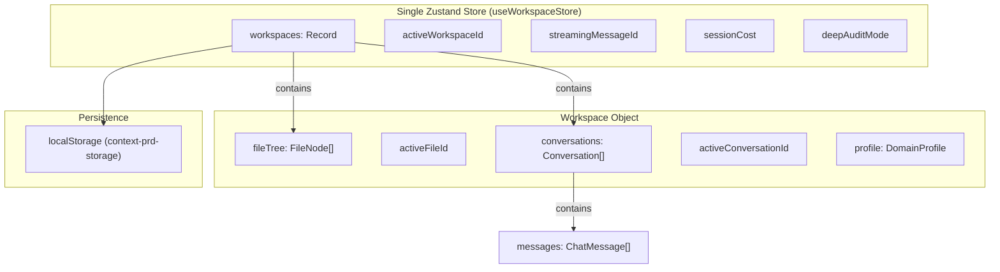
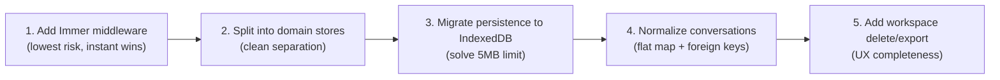

# ContextPRD — Workspace & Conversation Architecture Evaluation

## Current Architecture At A Glance



---

## Problem 1: God Store Anti-Pattern

Everything lives in a single `useWorkspaceStore` — workspace CRUD, file tree operations, all conversation logic, streaming state, cost tracking, and deep audit mode.

**Why it's a problem:**
- Every chat message update triggers a full Zustand recomputation, even for components that only care about the file tree
- The store has **25+ actions** on a single interface — it's becoming unmaintainable
- `temporal` (undo/redo via Zundo) wraps the entire store, meaning undo history includes chat messages, streaming state, and cost — none of which should be undoable

### Suggested Improvement: Split Into Domain Stores

```
src/store/
├── useWorkspaceStore.ts      # Workspace + file tree only
├── useConversationStore.ts   # Conversations + messages
├── useEditorStore.ts         # Active file, view mode, draft state
└── useSessionStore.ts        # Streaming state, cost, audit mode (non-persisted)
```

| Store | Persisted? | Undo? | Responsibilities |
|-------|-----------|-------|-----------------|
| `useWorkspaceStore` | ✅ | ✅ | Workspace CRUD, file tree, file content |
| `useConversationStore` | ✅ | ❌ | Conversations, messages, active conversation |
| `useEditorStore` | ❌ | ❌ | Active file ID, view mode, cursor, draft state |
| `useSessionStore` | ❌ | ❌ | Streaming ID, cost, audit mode, abort controller |

> [!IMPORTANT]
> The current `temporal()` wrapper around the whole store means that pressing Ctrl+Z could potentially undo a chat message deletion or revert the streaming message ID. Only file content mutations should be undoable.

---

## Problem 2: Deeply Nested Immutable Updates

Every mutation requires 4-5 levels of spread operators:

```typescript
// Current: Updating a single chat message requires this nightmare
set((state) => ({
  workspaces: {
    ...state.workspaces,
    [workspaceId]: {
      ...workspace,
      conversations: workspace.conversations.map((c) =>
        c.id === conv.id
          ? {
              ...c,
              messages: c.messages.map((msg) =>
                msg.id === messageId ? { ...msg, content } : msg
              ),
            }
          : c
      ),
    },
  },
}));
```

This is happening on **every single streaming chunk** (≈50-100 times per second during AI response).

### Suggested Improvement: Use Immer Middleware

```typescript
// With Immer: Same operation, readable and performant
set((state) => {
  const conv = getConversation(state.workspaces[workspaceId]);
  const msg = conv.messages.find(m => m.id === messageId);
  if (msg) msg.content = content;
});
```

Zustand has first-class `immer` middleware support. This eliminates the deep spread chains and makes mutations readable.

---

## Problem 3: localStorage Will Break at Scale

The entire store — including all workspace file contents and all conversation message histories — is serialized into a single `localStorage` key (`context-prd-storage`).

**Why it breaks:**
- `localStorage` has a **5MB limit** per origin in most browsers
- A workspace with 10 files × 5KB + 3 conversations × 50 messages ≈ 200KB
- 10 workspaces = **2MB**. With heavy usage, you'll silently hit the cap and lose data
- Full JSON serialization/deserialization on every state change is expensive

### Suggested Improvement: IndexedDB with Lazy Loading

```
Persistence Strategy:
├── localStorage → Lightweight metadata only
│   ├── Active workspace ID
│   ├── Workspace names & categories (index)
│   └── UI preferences
│
└── IndexedDB → Heavy content
    ├── Object Store: "files"      → { workspaceId, fileId, content }
    ├── Object Store: "messages"   → { conversationId, messages[] }
    └── Object Store: "workspaces" → { id, name, profile, fileTreeStructure }
```

Libraries like `idb-keyval` or Zustand's `createJSONStorage` with a custom IndexedDB adapter make this trivial.

> [!TIP]
> With IndexedDB, you can lazy-load workspace content. When the user switches workspaces, only load the file tree structure immediately, then hydrate file contents on-demand when a file is opened.

---

## Problem 4: Conversations Are Tightly Coupled to Workspaces

Currently, conversations are an array embedded directly inside the `Workspace` object. This creates several issues:

1. **No cross-workspace conversations** — You can't reference multiple workspace files in a single conversation
2. **Conversation search is O(n²)** — Finding a message requires iterating workspaces → conversations → messages
3. **Migration is fragile** — The `migrateWorkspace()` function exists solely because conversations were retrofitted into the workspace object

### Suggested Improvement: First-Class Conversation Entity

```typescript
// conversations.ts
interface Conversation {
  id: string;
  workspaceId: string;        // Foreign key relationship
  name: string;
  messages: ChatMessage[];
  createdAt: number;
  updatedAt: number;
  metadata?: {
    activeFileId?: string;    // Track which file was being discussed
    intent?: SkillIntent;     // What skill was being used
    modelUsed?: string;       // Which model generated responses
  };
}

// Store: Flat map instead of nested array
conversations: Record<string, Conversation>
activeConversationId: string | null
```

This is a classic **normalization** pattern. The workspace only stores a list of conversation IDs, while the actual conversation data lives in its own flat store. This makes lookups O(1) and enables future features like conversation search, pinning, and archiving.

---

## Problem 5: File Tree Is Flat-ish But Types Claim Nesting

The `FileNode` type declares `children?: FileNode[]`, suggesting a recursive directory tree. But `blueprintToFileTree()` only produces flat arrays. The `updateFileContent()` function has recursive traversal logic that's currently dead code for templates but would break if someone actually created nested directories.

### Suggested Improvement: Normalize the File Tree

```typescript
// Flat file map (like a real filesystem index)
interface FileStore {
  files: Record<string, FileNode>;         // fileId → FileNode
  fileOrder: Record<string, string[]>;     // parentId → [childId, ...]
  rootFiles: string[];                     // Top-level file IDs
}

// FileNode simplified
interface FileNode {
  id: string;
  name: string;
  path: string;
  parentId: string | null;
  type: 'markdown' | 'directory';
  // Content stored separately for lazy loading
}

// Content stored in its own map
interface FileContentStore {
  contents: Record<string, string>;        // fileId → content
  dirtyFiles: Set<string>;                 // Files with unsaved changes
}
```

> [!TIP]
> Separating `FileNode` metadata from file content means switching between files in the tree doesn't require loading content until the user actually opens the file.

---

## Problem 6: No Workspace Delete or Export

The store has `createWorkspace` but no `deleteWorkspace` or `exportWorkspace`. Once a workspace is created, there's no way to remove it through the UI. Old workspaces accumulate forever in localStorage, accelerating the storage limit problem.

### Suggested: Add Workspace Lifecycle Actions

```typescript
deleteWorkspace: (id: string) => void;
duplicateWorkspace: (id: string, newName: string) => string;
exportWorkspace: (id: string) => WorkspaceExport;  // JSON blob for download
importWorkspace: (data: WorkspaceExport) => string;
```

---

## Problem 7: Streaming State Is Global, Not Per-Conversation

`streamingMessageId` is a single global value. If you switch conversations while streaming, the abort logic fires and kills the stream. This is intentional but limits future capabilities like background generation.

### Suggested: Scope Streaming to Conversations

```typescript
// Instead of global streaming state
streamingMessageId: string | null;

// Use per-conversation streaming state
interface ConversationState {
  // ...existing fields
  streamingMessageId: string | null;
  abortController: AbortController | null;
}
```

---

## Summary: Priority Ranking

| # | Issue | Impact | Effort | Priority |
|---|-------|--------|--------|----------|
| 1 | localStorage 5MB limit | 🔴 Data loss risk | Medium | **P0** |
| 2 | God store / split stores | 🟡 Maintainability | Medium | **P1** |
| 3 | Deep spread chains (Immer) | 🟡 Performance during streaming | Low | **P1** |
| 4 | Normalize conversations | 🟢 Extensibility | Medium | **P2** |
| 5 | Normalize file tree | 🟢 Extensibility | Medium | **P2** |
| 6 | Missing workspace lifecycle | 🟡 UX gap | Low | **P2** |
| 7 | Scope streaming state | 🟢 Future feature | Low | **P3** |

---

## Recommended Execution Order



> [!NOTE]
> Step 1 (Immer) can be done in 30 minutes with zero breaking changes. It's a pure middleware swap. Steps 2-3 are the big wins but require careful migration of existing `localStorage` data.
