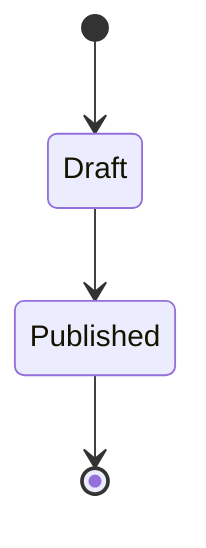

# Web App: Product Features & Requirements

## Core Feature Modules

### 1. Authentication & User Management
*   **Sign-up / Login:** Email + password, Google OAuth 2.0, GitHub OAuth.
*   **Session Management:** JWT access tokens (15 min expiry) + HTTP-only refresh tokens (7 days).
*   **MFA:** Optional TOTP-based two-factor authentication via authenticator app.
*   **Roles:** Admin, Member, Viewer — enforced at both API and UI layer.
*   **Password Policy:** Minimum 10 chars, 1 uppercase, 1 number, 1 symbol. Bcrypt hashing (cost 12).

### 2. Main Dashboard
*   **Objective:** Centralized hub showing activity feed, quick-access items, and key metrics.
*   **Widgets:** Draggable, resizable cards. Layout persisted per user in their profile settings.
*   **Notifications:** Real-time in-app notification bell via WebSocket. Mark-all-read, filter by type.
*   **Search:** Global fuzzy search across all user-owned records (Fuse.js, debounced 300ms).

### 3. Core Workspace / Editor
*   **Autosave:** Content saved to server after 500ms of inactivity. Optimistic UI with conflict detection.
*   **Version History:** Last 30 versions stored server-side. User can preview diff and restore any version.
*   **Collaboration Indicators:** Show avatars of active viewers on same document (cursor presence in v2).
*   **Export:** Download as PDF (via headless Chrome) or raw Markdown file.

### 4. Settings & Billing
*   **Profile:** Avatar upload (max 2MB, JPG/PNG), display name, timezone, notification preferences.
*   **Plan Management:** View current plan, usage stats, upgrade/downgrade via Stripe Customer Portal link.
*   **API Keys:** Generate personal API keys with configurable scopes. Revoke individually.
*   **Audit Log:** Last 90 days of account activity visible to Admins.

## User Persona Profiles
*   **Power User:** Daily active, relies on keyboard shortcuts, expects < 100ms UI feedback.
*   **Occasional User:** Logs in weekly, needs clear onboarding hints and progressive disclosure of advanced features.
*   **Admin:** Manages team members, billing, and audit logs — requires a dedicated settings panel.

## Core Feature State Diagram
