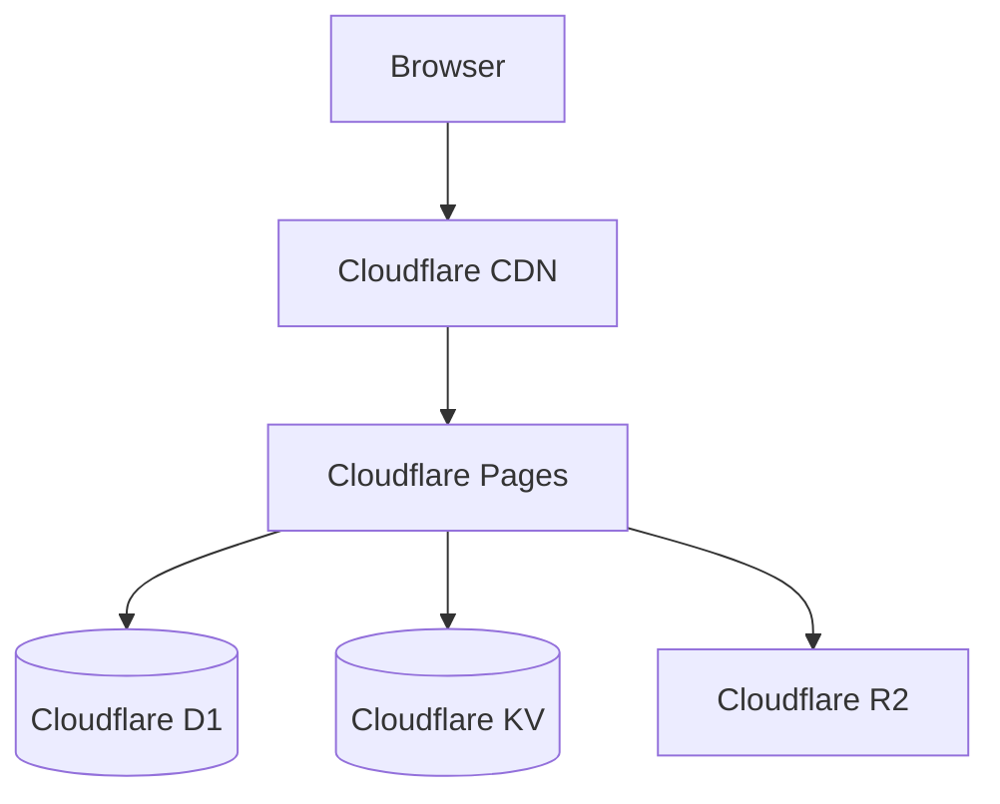

# Web App: Architecture Blueprint

## Technology Stack
- **Frontend**: Next.js 14 (App Router), TypeScript. Hosted on **Cloudflare Pages**.
- **Styling**: Tailwind CSS + shadcn/ui. Utility-first, accessible component primitives.
- **State**: Zustand (client) + React Query v5 (server). Separation of UI state and server cache.
- **Database**: **Cloudflare D1** (Serverless SQLite). High-throughput edge-ready database.
- **Cache/Queue**: **Cloudflare KV**. Serverless key-value store for sessions and caching.
- **Auth**: NextAuth.js v5 (JWT + OAuth). Edge-compatible session handling.
- **File Storage**: **Cloudflare R2**. S3-compatible, zero egress fee object storage.
- **API**: REST (v1) — GraphQL considered for v2. Simpler HTTP caching, broad client compatibility.

## System Architecture Diagram


## Caching Strategy
*   **Client:** React Query stale-while-revalidate. TTL: 60s for lists, 5min for detail views.
*   **Edge:** Cloudflare Page Rules/Cache Rules for static assets. `Cache-Control: s-maxage=3600, stale-while-revalidate=86400`.
*   **Server:** Cloudflare KV for session tokens and rate-limit counters (TTL: 5min).
*   **Database:** Cloudflare D1 (serverless, no connection pooling required).

## Core Data Model
```sql
users           — id, email, name, avatar_url, role, hashed_password, created_at
workspaces      — id, owner_id, name, settings JSONB, created_at
workspace_members — workspace_id, user_id, role, joined_at
documents       — id, workspace_id, title, content TEXT, version INT, updated_at, updated_by
document_versions — id, document_id, content_snapshot, created_by, created_at
api_keys        — id, user_id, key_hash, scopes TEXT[], last_used_at, revoked_at
```

## Error Handling
*   All API errors follow RFC 7807 Problem Details: `{ type, title, status, detail, instance }`.
*   Unhandled exceptions caught by global error boundary — logged to Sentry + user sees friendly error page.
*   Database query errors retried up to 3 times with exponential backoff before surfacing to caller.