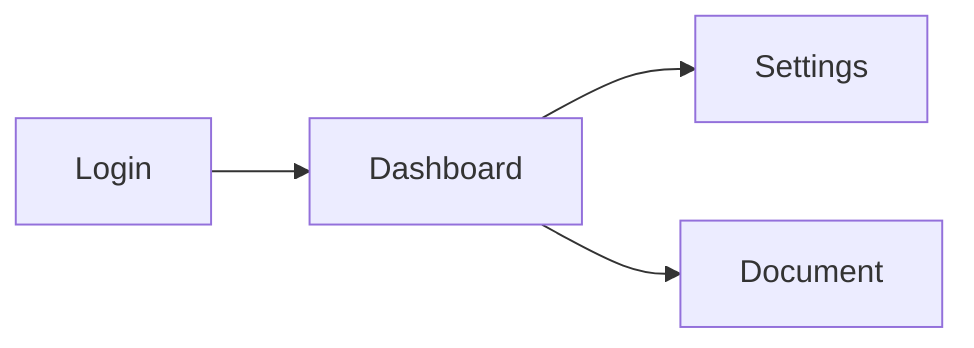

# Web App: UI/UX Specification

## Design System
*   **Component library:** shadcn/ui on top of Radix UI primitives (accessible by default).
*   **Color Palette (Dark Mode Primary):**
    *   Background: `hsl(222 47% 6%)`
    *   Surface: `hsl(222 47% 10%)`
    *   Border: `hsl(222 47% 16%)`
    *   Primary (Indigo): `hsl(245 80% 65%)`
    *   Destructive (Red): `hsl(0 72% 51%)`
    *   Muted text: `hsl(215 20% 55%)`
*   **Typography:** Inter (all UI text), JetBrains Mono (code, monospace). Base: 14px / 1.5 line-height.
*   **Spacing:** 4px base unit — all spacing is a multiple of 4 (4, 8, 12, 16, 24, 32, 48, 64).
*   **Border Radius:** sm=4px, md=8px, lg=12px, xl=16px, pill=9999px.
*   **Motion:** Prefer `ease-out` 150ms for appear, `ease-in` 100ms for disappear. No motion if `prefers-reduced-motion`.

## Shell Layout
*   **Top Nav Bar (56px fixed):** Logo → Global search (⌘K) → Notifications → User avatar.
*   **Left Sidebar (240px, collapsible):** Workspace switcher → Document tree → Settings link.
*   **Main Content:** Fluid width, max-width 900px for editor views, full-width for dashboards.
*   **Right Panel (optional, 320px):** Context-dependent — comments, version history, AI assistant.

## Key User Flows

### New User Onboarding
1. Sign up → Email verification link → Set display name & avatar (skippable) → Create first workspace (3-step wizard: name → category → invite teammates) → Dashboard with sample document.

### Core Editing Loop
1. Click document in sidebar → Editor opens with autofocus → Type → Autosave indicator: `Saving…` → `Saved ✓` → Version counter increments.

### Keyboard Shortcuts
| Shortcut | Action |
|---|---|
| `⌘K` | Open global search / command palette |
| `⌘S` | Force save now |
| `⌘Z` / `⌘⇧Z` | Undo / Redo |
| `⌘⇧P` | Open command palette |
| `⌘B` | Toggle sidebar |
| `Esc` | Close modal / dismiss popover |

## Micro-interactions
*   **Button press:** `scale-[0.97]` + `brightness-90` for 95ms on active.
*   **Toast:** Slide-in from bottom-right, auto-dismiss after 4s, manual dismiss ✕.
*   **Skeleton loading:** Pulsing gray blocks matching the shape of the content — never blank white flash.
*   **Empty state:** Illustration + headline + single primary CTA (never an empty div).

## Application Flowchart
