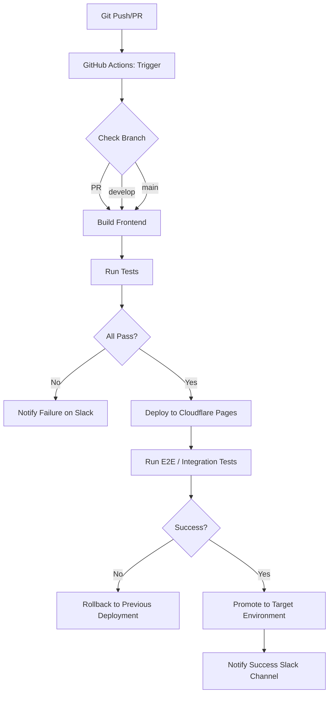

# Web App: Deployment & Ops

## Environments
- **Development**: feature branches → `localhost:3000` (Vite / Next.js dev server)
- **Preview**: pull requests → Cloudflare Pages preview URL (e.g., `abc123.yourapp.pages.dev`) – full environment with Workers & R2 emulation
- **Staging**: `develop` → `staging.yourapp.com` (integration testing, load testing, manual QA)
- **Production**: `main` → `app.yourapp.com` (live users, CDN cached, zero-downtime deployments)

## CI/CD Pipeline (GitHub Actions)
1. **On PR open:**  
   - ESLint + `tsc --noEmit`  
   - Vitest unit tests  
   - Playwright component tests
   - Deploy preview to Cloudflare Pages  
   - Notify `#preview` Slack channel

2. **On merge to `develop`:**  
   - All of the above  
   - Integration tests against Staging Workers + R2 (with `wrangler dev --remote`)  
   - Deploy to Staging (Pages + Workers + D1 migrations)  
   - Notify `#staging` Slack channel

3. **On merge to `main`:**  
   - All of the above  
   - Playwright E2E tests (full user flow)  
   - Lighthouse CI performance audit  
   - Deploy to Production (Pages + Workers + D1 migrations)  
   - Notify `#deploys` Slack channel + `#incidents` on failure

## Infrastructure
- **Frontend (Cloudflare Pages)**: Static site hosting, edge-side rendering for PWA shell, automatic serverless function support via `_headers`/`_redirects`.
- **API (Cloudflare Workers)**: OAuth token verification, presigned URLs, CRUD operations, D1 query layer.
- **Database (Cloudflare D1)**: User profiles, presets, edit history, session data. Automated daily backups via `wrangler d1 backup`.
- **Cache (Cloudflare KV)**: Session tokens, rate‑limiting counters, user preferences. Edge read replicas.
- **File Storage (Cloudflare R2)**: File uploads, exported assets, blob cache. Public buckets with signed URLs and CORS policies.
- **Email (Cloudflare Email Workers / MailChannels)**: Transactional emails (welcome, password reset, completion events).
- **DNS & Security (Cloudflare DNS + WAF)**: CNAME flattening for `app.yourapp.com`, DDoS protection, bot management, geo‑blocks for GDPR compliance.

## Monitoring & Alerting
- **Sentry** (JavaScript source maps)  
  - Alert: Error spike > 10/min on any `worker` or frontend transaction  
- **Cloudflare Web Analytics** (Core Web Vitals)  
  - Alert: P75 LCP > 3 s or P75 CLS > 0.25  
- **Uptime Robot** (`/api/health` endpoint on Workers)  
  - Alert: 2 consecutive failures (2‑minute intervals)  
  - Alert: Response latency > 500 ms (P95)
- **Cloudflare Logpush** → **Axiom**  
  - Structured logs from Workers (actions, failures, OAuth errors)  
  - Ad‑hoc queries: `SELECT count() FROM logs WHERE httpStatusCode >= 500`
- **D1 Monitoring** (via `wrangler d1 info` + Axiom)  
  - Alert: Total query latency > 200 ms (P99)  
  - Alert: Storage usage > 80% of D1 free tier (automated scale check)

## Runbooks

### Rollback (Frontend)
1. Cloudflare Pages Dashboard → **Deployments** → select last successful production build.  
2. Click **Retry deployment** → Pages automatically promotes that deployment to production.  
3. Verify with `curl -I https://app.yourapp.com` (status 200, expected commit hash in `X-Pages-Deployment-Id` header).  
4. If needed, use **Quick Rollback** button (one‑click to previous stable version).

### Rollback (Database Migration)
> **Prerequisites:** Cloudflare API token with D1 write permissions, `wrangler` installed.
1. `npx wrangler d1 migrations rollback yourapp-db --local` (dry‑run locally).  
2. `npx wrangler d1 migrations rollback yourapp-db --remote` (apply to production).  
3. Verify with `npx wrangler d1 migrations list yourapp-db`.  
4. Run a manual smoke test on `/api/health` and a basic query.

### Scale Up (DB / Workers)
- **D1**: Auto‑scales storage and concurrency. No manual action required. If approaching storage limit, enable **D1 storage expansion** via Cloudflare Dashboard (automatic).  
- **Workers**: CPU / memory limits are fixed. If `CPU‑time` errors appear, refactor heavy calls to use **Durable Objects** or split into separate sub‑workers.  
- **R2**: No scaling needed; zero‑egress and infinite capacity.

## Deployment Pipeline Diagram

*Legend:*  
- **PR** → Preview environment (automatic URL)  
- **develop** → Staging environment  
- **main** → Production environment (requires Playwright E2E + Lighthouse CI)  
- All deployments include Workers + D1 migrations + R2 bucket updates via `wrangler deploy`.