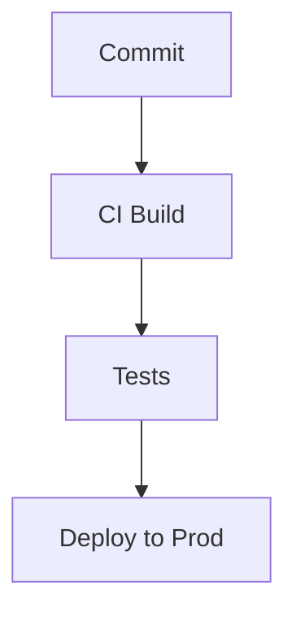

# Web App: Deployment & Ops

## Environments
- **Development**: feature branches -> `localhost:3000` (Local development)
- **Preview**: pull requests -> Cloudflare Pages preview URL (PR review & QA)
- **Staging**: `develop` -> `staging.yourapp.com` (Integration testing)
- **Production**: `main` -> `app.yourapp.com` (Live users)

## CI/CD Pipeline (GitHub Actions)
1.  **On PR open:** ESLint + tsc type-check → Vitest unit tests → Preview deploy to Cloudflare Pages.
2.  **On merge to `develop`:** All above + integration tests → Deploy to Staging → Notify #staging Slack.
3.  **On merge to `main`:** All above + Playwright E2E tests → Deploy to Production → Notify #deploys Slack.

## Infrastructure
*   **Frontend:** Cloudflare Pages (auto-scaling, global edge network, zero-config SSL).
*   **Database:** Cloudflare D1 (Serverless SQLite). Automated backups via Wrangler.
*   **Cache:** Cloudflare KV (Key-Value edge storage).
*   **File Storage:** Cloudflare R2 (S3-compatible API, zero egress fees).
*   **Email:** Cloudflare Email Workers / MailChannels for transactional email.

## Monitoring & Alerting
- **Sentry**: Frontend + API errors. Alert: Spike > 10 errors/min
- **Cloudflare Web Analytics**: Core Web Vitals (LCP, FID, CLS). Alert: P75 LCP > 3s
- **Uptime Robot**: `/api/health` endpoint. Alert: 2 consecutive failures (2min)
- **Cloudflare Logpush**: Detailed request/worker logs routed to Axiom/Datadog.
- **Axiom**: Structured application logs. Alert: Query on demand

## Runbooks

### Rollback (Frontend)
1. Cloudflare Pages Dashboard → Deployments → select last successful build → **Retry deployment**.

### Rollback (Database Migration)
1. `npx wrangler d1 migrations rollback <DB_NAME>` (requires Cloudflare credentials).
2. Verify with `npx wrangler d1 migrations list`.

### Scale Up (DB)
1. Cloudflare D1 auto-scales seamlessly. No manual instance sizing required!

## Deployment Pipeline Diagram
